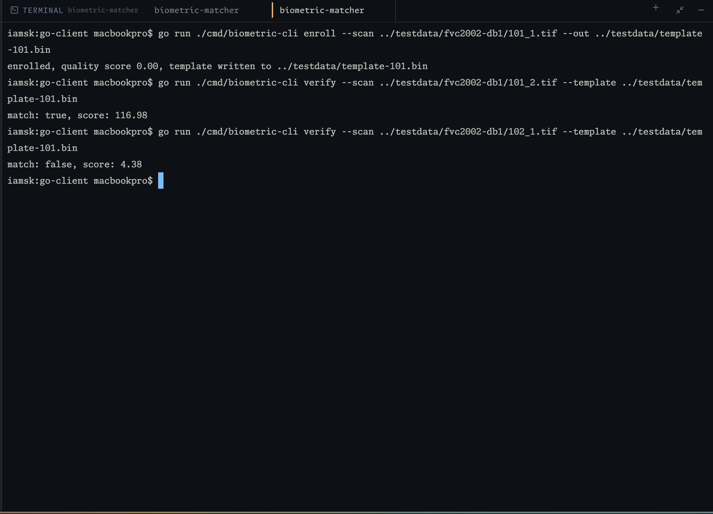

# biometric-matcher

A fingerprint enrollment/verification/identification system split across two
services on purpose:

- **java-matcher** — stateless gRPC service wrapping
  [SourceAFIS](https://sourceafis.machinezoo.com/) for minutiae extraction
  and matching. Never touches a database, never sees a name or DOB, only
  raw scan bytes and templates.
- **go-client** — CLI + eventual API gateway. Owns persistence, encryption
  of stored templates, and all biographic data. Calls java-matcher over
  gRPC for anything biometric.

The split exists so the matching engine can be swapped, scaled, or
re-benchmarked (e.g. against NIST NBIS) without touching how identities
are stored or exposed. See `proto/biometric.proto` for the full contract
and the reasoning behind each RPC.

## Layout

```
proto/                  shared source of truth for the gRPC contract
java-matcher/            SourceAFIS-backed matcher service
go-client/                CLI and generated Go client stubs
```

`proto/biometric.proto` is the canonical copy. The copy under
`java-matcher/src/main/proto/` exists only because Gradle's protobuf
plugin expects proto files inside the module. If the contract changes,
edit `proto/biometric.proto` and re-copy, don't edit both independently.

## Getting both sides running

### 1. Generate code from the proto

```
make proto
```

This generates the Go client/server stubs into `go-client/gen/biometricpb`
and lets Gradle's protobuf plugin handle Java codegen automatically on
build. Requires `protoc` and the Go gRPC plugins locally, see the Makefile
for the exact install commands if you don't have them.

### 2. Java matcher

No `gradlew` is committed in this scaffold (generating one needs a real
`gradle` install and network access to Gradle's distribution servers).
Two options:

**Docker (recommended, no local Gradle needed):**

```
docker-compose up --build
```

Builds against `gradle:8.9-jdk21` directly, see `java-matcher/Dockerfile`.

**Local, if you have Gradle installed** (`brew install gradle` on macOS):

```
cd java-matcher
gradle run
```

The first time you do this, it's worth running `gradle wrapper` too and
committing the result (`gradlew`, `gradlew.bat`, `gradle/wrapper/`), so
nobody else on this repo needs Gradle installed locally either.

Either way, `MatcherServiceImpl.java` has real enroll/verify/identify
logic wired to SourceAFIS, not stubs, see the comments there for the
reasoning behind the match threshold and DPI constant.

### 3. Get some real fingerprint data to test with

```
chmod +x scripts/fetch-testdata.sh
./scripts/fetch-testdata.sh
```

The executable bit doesn't always survive a copy/paste or a zip extract,
so `chmod +x` first if you get a "permission denied".

Pulls FVC2002 DB1_B, the dataset SourceAFIS's own tutorial recommends for
trying it out. See `testdata/README.md` for match/non-match test pairs.

### 4. Go CLI

```
cd go-client
go run ./cmd/biometric-cli enroll --scan ../testdata/fvc2002-db1/101_1.tif --out ../testdata/template-101.bin
go run ./cmd/biometric-cli verify --scan ../testdata/fvc2002-db1/101_2.tif --template ../testdata/template-101.bin
```

## Verified working

Tested end to end against real FVC2002 DB1_B fingerprint scans, full
round trip through the Go CLI, gRPC, and the Java/SourceAFIS matcher:

```
$ go run ./cmd/biometric-cli enroll --scan ../testdata/fvc2002-db1/101_1.tif --out ../testdata/template-101.bin
enrolled, quality score 0.00, template written to ../testdata/template-101.bin

$ go run ./cmd/biometric-cli verify --scan ../testdata/fvc2002-db1/101_2.tif --template ../testdata/template-101.bin
match: true, score: 116.98

$ go run ./cmd/biometric-cli verify --scan ../testdata/fvc2002-db1/102_1.tif --template ../testdata/template-101.bin
match: false, score: 4.38
```



Same finger, different impression, scores 116.98, well past the 40.0
threshold. A genuinely different finger scores 4.38, nowhere close.
Quality score reads 0.00 as expected, see the note in
`MatcherServiceImpl.java` on why that field is intentionally unset.

## What's deliberately not built yet

- Template encryption at rest, nothing implemented yet, `client.go`'s
  comments note that `internal/client` is where it should live once
  built, but there's no TODO marker or stub there, this is a genuine
  gap, not a started piece
- Postgres schema for the register (biographic table + encrypted template
  table, kept separate on purpose)
- Liveness detection, this is a hardware/firmware concern, not something
  this service layer can meaningfully fake without real sensor SDK access
- Auth between go-client and java-matcher, fine on localhost during
  development, not fine before this goes anywhere near a real network
